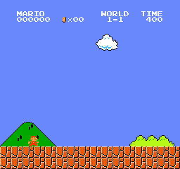

# Mario RL — 一个网络通关《超级马里奥兄弟》多个世界

用强化学习从零教 agent 玩 NES《超级马里奥兄弟》，从单关 PPO 起步，一路做到
**单个神经网络连续通关三个世界共 12 关**。全程在一台 Mac 上跑（纯 CPU），
记录了每一步的实验、翻车和修复。

基于 [`gym-super-mario-bros`](https://github.com/Kautenja/gym-super-mario-bros) 模拟器
+ [`stable-baselines3`](https://github.com/DLR-RM/stable-baselines3) 的 PPO。

## 成果

| 世界 | 平均通关率 | 录像 |
|---|---|---|
| World 1 (1-1 ~ 1-4) | 52% | `mario_world1.gif` |
| World 2 (2-1 ~ 2-4) | 59% | `mario_world2.gif` |
| World 3 (3-1 ~ 3-4) | 60% | `mario_world3.gif` |
| World 1+2 八关合并（单网络） | 52% | `mario_all8.gif` |

一个网络连续打通八关：



最难啃的 2-2 水下关（一格宽的鱼缝 + 来回游的 Cheep-Cheep）：


## 方法论：为什么不是"一个 PPO 硬训所有关"

直接拿 PPO 混训多关会**打地鼠**——学会一关就忘另一关（灾难性遗忘 + 任务干扰）。
真正跑通的是一条「专家 → 蒸馏 → 合并」的流水线：

1. **单关专家**：每个难关单独用 PPO 训一个专家（小 NatureCNN），冲到 80-90%。
   容易的关用混训（`SuperMarioBrosRandomStages` 随机采样）一把拿下，只给钉子户单独补专家。
2. **收老师数据**：让每个专家自己跑（随机采样），记下 `(画面 → 老师的 7 个动作概率)`。
3. **软策略蒸馏**：一个学生网络用监督学习模仿所有老师的动作分布
   （soft policy distillation，KL 软交叉熵 `-Σ p_老师 · log q_学生`）。纯监督，又快又稳。
4. **DAgger 补漂移**：学生自己开车、老师在它走偏的状态上打标签，补进数据重蒸——
   治蒸馏的分布漂移（学生一旦偏离老师示范的成功轨迹就懵）。
5. **WideCNN 扩容量**：关数多了，小网络塞不下（最难的反应式水关先被挤掉），
   换加宽的 CNN 在监督蒸馏里接住。
6. **跨世界合并**：把多个世界的蒸馏数据合在一起，蒸一个网络。

关键认知：**蒸馏/DAgger 是监督学习，分钟级又稳；昂贵的 RL 只在训专家时付一次。**

## 一路踩平的坑（实战笔记）

- **稀疏奖励 → 梯子塑形**：2-2 真信号只有摸到旗杆（x≈3161），中间全程"做对了也没人告诉你"。
  裸专家黑灯瞎火卡在 5%。在硬点前摆一排一次性 checkpoint 奖励（把远期大奖拆成密集近期路标），
  通关率 5% → 70%。
- **det vs stochastic 评估**：没收敛的策略别用 `deterministic=True` 评估——argmax 会卡在某个
  概率性障碍前反复送死，严重低估真实能力。看随机采样。
- **容量 vs 任务干扰**：关越多，容量越紧张，最不合群的关（水关/迷宫）总是第一个掉血。
  通用关之间高度冗余（都是"往右冲 + 该跳就跳"），反而互相正迁移（1-3 在八关里比单训还强）。
- **custom CNN 双重 /255 归一化 bug**：自带归一化的 features extractor + sb3 默认 `normalize_images=True`
  → 输入被除两次成 ~[0,0.004] → 激活塌缩、loss 卡死不降。修复：`policy_kwargs=dict(normalize_images=False)`。
- **numpy 必须 <2**：nes-py / gym 跟 numpy 2.x 不兼容（`OverflowError`）。装 torch/sb3 时会被升回去，记得压回。
- **内存墙**：把多个世界塞进一个网络时，蒸馏数据随关数线性涨（12 关 obs ≈ 25GB），
  36GB 机器装不下 → swap 卡死。单世界 student（~4GB）毫无压力；全量大合并该上大内存机器。

## 环境搭建

需要 **Python 3.10**（老的马里奥库不支持 3.12+）。

```bash
python3.10 -m venv venv
source venv/bin/activate
pip install -U pip
pip install -r requirements.txt
# 若 numpy 被升级回 2.x：
pip install 'numpy<2'
```

## 怎么跑

```bash
# 单关专家 / 混训
python train_world1.py 3000000          # World 1 四关混训
python train_2_2_ladder.py 3000000      # 2-2 梯子塑形（续训自塑形专家）

# 蒸馏流水线
python collect_distill_w2.py            # 收老师数据
python distill_w2_wide.py 35 cpu        # 蒸 WideCNN 学生
python collect_dagger_w2.py             # DAgger 收漂移数据 → 重蒸

# 评测 / 录像
python eval_stages.py                    # 逐关通关率
python record_world2_montage.py mario_w2_wide.zip   # 录通关 GIF
```

## 文件导览

| 类别 | 文件 |
|---|---|
| 环境 | `make_env.py`（gym→gymnasium 翻译 / 跳帧 / 灰度缩放 / 叠帧；各关 / 塑形奖励工厂函数） |
| 网络 | `wide_cnn.py`（加宽 NatureCNN）、`impala_cnn.py`（残差版，RL 里训不动的反面教材） |
| 专家训练 | `train_world{1,2,3}*.py`、`train_{1_3,2_1,2_2,3_1}_expert*.py`、`train_2_2_ladder.py`（梯子塑形） |
| 蒸馏 | `collect_distill_*.py`、`distill_*_student.py`、`distill_*_wide.py`、`collect_dagger_*.py` |
| 合并 | `distill_all8_wide.py`（八关）、`distill_all12_*.py`（十二关，含内存优化版） |
| 评测/录像 | `eval_stages.py`、`eval_lstm22.py`、`record_*_montage.py`、`record_gif.py`、`plot_progress.py` |

> 训练产物（模型 `.zip`、检查点、蒸馏数据 `.npz`）体积太大没进仓，按上面的脚本可自行复现。
