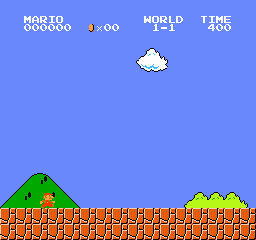
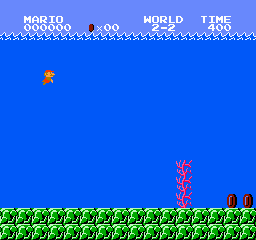

# Mario RL — 一个网络通关《超级马里奥兄弟》多个世界

用强化学习从零教 agent 玩 NES《超级马里奥兄弟》，从单关 PPO 起步，一路做到
**单个神经网络连续通关三个世界共 12 关**。专家训练、蒸馏、单世界 student 全在一台 Mac 上跑（纯 CPU），
只有最后的十二关大合并撞到内存墙，搬去一台 GPU 机器（详见下面「内存墙」）。
记录了每一步的实验、翻车和修复。

基于 [`gym-super-mario-bros`](https://github.com/Kautenja/gym-super-mario-bros) 模拟器
+ [`stable-baselines3`](https://github.com/DLR-RM/stable-baselines3) 的 PPO。

## 成果

| 世界 | 平均通关率 | 录像 |
|---|---|---|
| World 1 (1-1 ~ 1-4) | 52% | `mario_world1.gif` |
| World 2 (2-1 ~ 2-4) | 59% | `mario_world2.gif` |
| World 3 (3-1 ~ 3-4) | 60% | `mario_world3.gif` |
| World 1+2 八关合并（单网络） | 63% | `mario_all8.gif` |
| **World 1+2+3 十二关合并（单网络）** | **73%** | `mario_all12.gif` |

十二关逐关（每关 100 局随机采样）：1-1 60% / 1-2 86% / 1-3 95% / 1-4 57% /
2-1 76% / 2-2 70% / 2-3 76% / 2-4 71% / 3-1 73% / 3-2 79% / 3-3 78% / 3-4 54%——
一关都不挂零，最差的 3-4 也有 54%。

> ⚠️ **上面这张表的口径有系统性乐观偏差，后来才发现。** 这些评测每局都从"游戏刚启动"的同一状态开局，
> 敌人和移动平台的相位每次一样，策略可以靠背一段固定动作序列拿分。加上 Atari 标准的
> **no-op starts**（开局随机空按 0-30 帧，只改相位）之后，同一批模型十二关平均 **73% → 53%**，
> 其中 2-2 从 70% 掉到 4%。见下面「[评测口径这一课](#评测口径这一课no-op-starts)」——
> 那是这个项目最值钱的一段，也是唯一一次发现"之前所有数字都要打折"。

一个网络连续打通十二关：



最难啃的 2-2 水下关（一格宽的鱼缝 + 来回游的 Cheep-Cheep）：



## 方法论：为什么不是"一个 PPO 硬训所有关"

直接拿 PPO 混训多关会**打地鼠**——学会一关就忘另一关（灾难性遗忘 + 任务干扰）。
真正跑通的是一条「专家 → 蒸馏 → 合并」的流水线：

1. **单关专家**：每个难关单独用 PPO 训一个专家（小 NatureCNN），冲到 80-90%。
   容易的关用混训（`SuperMarioBrosRandomStages` 随机采样）一把拿下，只给钉子户单独补专家。
2. **收老师数据**：让每个专家自己跑（随机采样），记下 `(画面 → 老师的 7 个动作概率)`。
3. **软策略蒸馏**：一个学生网络用监督学习模仿所有老师的动作分布
   （soft policy distillation，KL 软交叉熵 `-Σ p_老师 · log q_学生`）。纯监督，又快又稳。
4. **DAgger 补漂移**：学生自己开车、老师在它走偏的状态上打标签，补进数据重蒸——
   治蒸馏的分布漂移（学生一旦偏离老师示范的成功轨迹就懵）。
5. **WideCNN 扩容量**：关数多了，小网络塞不下（最难的反应式水关先被挤掉），
   换加宽的 CNN 在监督蒸馏里接住。
6. **跨世界合并**：把多个世界的蒸馏数据合在一起，蒸一个网络。

关键认知：**蒸馏/DAgger 是监督学习，分钟级又稳；昂贵的 RL 只在训专家时付一次。**

## 一路踩平的坑（实战笔记）

- **稀疏奖励 → 梯子塑形**：2-2 真信号只有摸到旗杆（x≈3161），中间全程"做对了也没人告诉你"。
  裸专家黑灯瞎火卡在 5%。在硬点前摆一排一次性 checkpoint 奖励（把远期大奖拆成密集近期路标），
  通关率 5% → 70%。
- **det vs stochastic 评估**：没收敛的策略别用 `deterministic=True` 评估——argmax 会卡在某个
  概率性障碍前反复送死，严重低估真实能力。看随机采样。
- **容量 vs 任务干扰**：关越多，容量越紧张，最不合群的关（水关/迷宫）总是第一个掉血。
  通用关之间高度冗余（都是"往右冲 + 该跳就跳"），反而互相正迁移（1-3 在八关里比单训还强）。
- **custom CNN 双重 /255 归一化 bug**：自带归一化的 features extractor + sb3 默认 `normalize_images=True`
  → 输入被除两次成 ~[0,0.004] → 激活塌缩、loss 卡死不降。修复：`policy_kwargs=dict(normalize_images=False)`。
- **numpy 必须 <2**：nes-py / gym 跟 numpy 2.x 不兼容（`OverflowError`）。装 torch/sb3 时会被升回去，记得压回。
- **内存墙 → 换成显存**：把多个世界塞进一个网络时，蒸馏数据随关数线性涨（12 关 875k 帧 obs ≈ 25GB），
  36GB 机器装不下 → 压缩内存把随机访问拖慢 25 倍（~29min/epoch），磁盘 memmap 也救不了
  （25GB 远超 page cache，每 epoch 全 miss，从内存 bound 变磁盘 bound）。
  搬到一张 96GB 显存的卡上，**整份 obs 直接常驻显存**，每个 batch 就是一次显存内 gather，
  零 host→device 拷贝 → **9.3s/epoch（94k 帧/s），快约 180 倍**，60 epoch 十分钟跑完。
  蒸馏本来就是"数据全程只读、随机取 batch"，这种负载最适合整份塞进显存，而不是想办法在内存里省。
- **模型跨 numpy 大版本不通**：sb3 存的 zip 里 pickle 了 numpy 的内部布局，numpy 2.x 存的模型在
  numpy 1.x 里 load 直接 `ModuleNotFoundError: numpy._core.numeric`。而模拟器这条链路被 nes-py 钉死在
  numpy<2 → 蒸馏也必须在 numpy<2 的环境里做，别为了图快借一个 numpy 2 的环境训（训完发现评测加载不了）。
  更阴的是这个错误在多进程评测里表现为 **worker 全部静默消失、主进程永远等**——`mp.Pool` 检测不到
  worker 被硬杀，换 `ProcessPoolExecutor`（会抛 `BrokenProcessPool`）才看得见。
- **一个 bug 值多少，取决于在哪个设定里量**：同一个双重归一化 bug，在八关那个原始配方里吃掉 9.3pp，
  在数据更多、训得更久的十二关配方里只吃掉 2.9pp（网络能部分补偿被压到 ~[0,0.004] 的输入）。
  第一次我在后者量，得出"这 bug 不是主因"的结论——读反了。见下面「消融」。

## 消融：十二关合并（74%）比八关合并（63%）强在哪

三个变量：修不修双重归一化 bug / 30 还是 60 epoch / 喂八关(730k)还是十二关(875k)数据。
每次只动一个，每关 100 局随机采样（"八关均"= 那 800 局的合并通关率，±1SE≈1.7pp）。
一个 epoch 9 秒，六组训练 + 7200 局评测一小时内跑完——**便宜到没有理由靠猜**。

| 实验 | 数据 | epoch | 输入 | 八关均 | 十二关均 |
|---|---|---|---|---|---|
| ① 八关合并原配方 | 730k | 30 | 双重 /255 | **62.7%** | 41.8% |
| ② | 875k | 60 | 双重 /255 | 71.0% | 69.5% |
| ③ 十二关合并成果 | 875k | 60 | 正常 | **73.9%** | **72.9%** |
| ④ | 875k | 30 | 正常 | 72.0% | 71.4% |
| ⑤ | 730k | 60 | 正常 | 71.4% | 47.6% |
| ⑥ = ① 只修 bug | 730k | 30 | 正常 | **72.0%** | 48.0% |

- **修 bug：+9.3pp**（①→⑥，同数据同 epoch，>3σ）。八关合并那次低分的主因。
- **epoch 30→60：≈0**（⑥→⑤ −0.6pp，④→③ +1.9pp，都在噪声内）。686 万参的 WideCNN 在
  30 epoch 已经收够了，"大网络要多训"这条在这儿不成立。
- **加 World 3 数据：0 ~ +2.5pp**（60ep 时 ⑤→③ +2.5，30ep 时 ⑥→④ 0.0）。对老八关基本中性，
  但**新的四关是白送的**（③ 的 W3：73/79/78/54）。
- 所以「关越多容量越紧张」不成立：十二关在老八关上不输八关，还白拿四关。
  2-2 水关 38%（①）→57%（⑥）→70%（③），它当年被"挤掉"主要是输入残废，不是容量。
- **每关 30 局不够分辨这几 pp**：N=30 时某一关能在 57% 和 83% 之间跳（跨过 2σ），
  先用它挑方向，下结论前把样本量提到 100。

## 评测口径这一课：no-op starts

做到十二关合并之后，我去测了一件之前没测过的事：**把这个网络放进完整游戏，从 1-1 一路往下打，
它能连过几关？** 逐关成绩是 73%，直觉上应该能连过七八关。

实测：**平均 2.3 关**（32 局，最好 6 关）。

### 逐关 73%，连打 2.3 关，差距在哪

先按关卡拆开，看"进了某关之后清掉它的概率"（64 局连打统计）：

| | 1-1 | 1-2 | 1-3 | 1-4 | 2-1 | 2-2 |
|---|---|---|---|---|---|---|
| 逐关从头评 | 60% | 86% | 95% | 57% | 76% | 70% |
| 连打中 | 81% | 88% | **57%** | 88% | 70% | **25%** |

掉的两关是 1-3 和 2-2——**一个是浮空移动平台，一个是来回游的 Cheep-Cheep，共同点是"障碍物在动"**。
其余静态地形为主的关卡不降反升。而且连打里死在 2-2 的位置是 x=1235~1544，
比它历史上的硬点 x≈2095 早得多：不是过不了那道一格宽的鱼缝，是中段就被鱼撞了。

### 单变量实验：只改敌人相位

开局随机空按几帧（no-op starts），别的什么都不动——地形、马里奥形态、时间、模型全一样，
只是敌人和平台的相位被推开：

| 2-2 的通关率 | 0 帧 | 2 帧 | 4 帧 | 8 帧 | 16 帧 | 30 帧 |
|---|---|---|---|---|---|---|
| 梯子专家 | 66% | 36% | 26% | 18% | 6% | 4% |
| 十二关学生 | 80% | 24% | 12% | 10% | 6% | 4% |

**抖 2 帧——1/30 秒——通关率腰斩。** 这不是鲁棒性不够，是整套动作跟鱼的位置逐帧锁死。

按 Atari 标准口径（0-30 帧）重测所有模型：

| | 无抖动 | no-op 0-30 |
|---|---|---|
| 十二关学生 | 70.2% | **52.8%** |
| 各关老师（在自己那关上） | 74.3% | **56.0%** |

**背轨迹的是老师本身，不是蒸馏引入的。** 所以这在蒸馏阶段修不了——RL 训练本身就得带 no-op starts。
（注意 2-3 / 2-4 / 3-2 / 3-3 几乎不掉甚至微涨：那几关的老师是真会玩。不是全线崩，
是"有移动威胁且时序可锁死"的关在崩。）

这就是 Atari benchmark 用 no-op starts 的原因，这套管线从头到尾缺了这一环。

### 重新解释两个旧结论

- **「2-2 梯子塑形把通关率从 5% 拉到 70%」**：塑形教会它的主要是"把这段舞步跳完整"，
  而不是"看见鱼就躲"。同一个模型加上抖动只剩 4%。
- **「LSTM 治不了 2-2 的反应式躲避」**：那个环境根本没要求过反应——前馈网络靠背就能拿分，
  记忆能力显不出优势。这个实验得在带抖动的环境里重做才有意义。

### 带抖动重训 2-2

从梯子专家 warm-start，带 no-op starts 训（最好的配方是**课程式加压**：抖动量 0-4 → 0-8 → 0-16 → 0-30
逐级 warm-start，每级 2M 步）：

| 2-2 @ no-op 0-30（N=400） | argmax | 随机采样 |
|---|---|---|
| 梯子专家（原始） | 3% | 7% |
| 直训 8M | 3% | 20% |
| **课程 8M** | **35%** | 22% |

两个观察：

- **训完之后 Δ(有抖动 − 无抖动) ≈ 0**（直训 8M 是 25%/25%）——策略变成真正相位无关的了，
  不再吃相位红利，也不再怕相位变化。只是绝对水平只有当年那个"78%"的三分之一。那才是实数。
- **课程和直训学出了性质相反的策略**：直训的靠随机性活着（argmax 只有 3%），
  课程的是尖的（argmax 35%、无抖动 100%）。分级加压逼出了确定的应对，一步登天只逼出了对冲。

同样在抖动下重训老师，World 1 混训 5M 步：平均 40.5% → 52.8%，**1-3 从 0% 到 59%**。
这条路是通的，代价是 1-2 掉了（打地鼠老问题）。

### 收口：全链路都在诚实口径下重跑一遍

按上面的发现把整条流水线重做：**逐关挑抖动下实测最强的那个老师**（抖动重训不是全面胜利——
W3 大胜 3-4 44%→78% / 3-1 3%→64%，W1 半胜 1-3 0%→59% 但 1-2 49%→17%，W2 反而变差，
所以必须一关一关挑）→ 抖动开局重收 840k 帧 → 重蒸学生 → 三种口径评测。

| | 旧口径（送分） | 诚实口径 |
|---|---|---|
| 十二关学生逐关（起点） | 73% | 52.8% |
| 换成最强老师班底重蒸 | — | **58.7%**（随机采样） |
| 按关挑推理模式 | — | **73.3%** |
| 完整游戏连打 | 2.3 关 | 2.5 关 |

三条能带走的结论：

**① 老师→学生的传导差约 6pp。** 老师班底平均 56% → 64.7%，学生 53.8% → 58.7%。
学生稳定落在老师下方一个固定差值——**想抬学生只能先抬老师**，补数据、加轮次、换网络都绕不过这条。

**② argmax 和采样的优劣是逐关分裂的**，而且分裂得极端（`mario_honest12` @ no-op 0-30）：

| | 1-1 | 1-2 | 1-3 | 1-4 | 2-1 | 2-2 | 2-3 | 2-4 | 3-1 | 3-2 | 3-3 | 3-4 |
|---|---|---|---|---|---|---|---|---|---|---|---|---|
| 采样 | 60% | 55% | 62% | 55% | 45% | 10% | 77% | 61% | 51% | 74% | 86% | 68% |
| argmax | 29% | 9% | 24% | **100%** | 56% | 13% | 13% | **100%** | 81% | 83% | **100%** | 93% |

1-4 是 argmax 100% / 采样 55%，1-2 反过来是 argmax 9% / 采样 55%。**按关挑模式**（`run_fullgame.py`
的 `auto` 打法）把诚实的逐关平均推到 73.3%——跟最上面那个虚高的 73% 数字相同，但这次站得住。

**③ 瓶颈收敛成一个单点：2-2。** 按关挑模式之后，连打里前五关的条件成功率是
1-1 71% / 1-2 79% / 1-3 74% / 1-4 95% / 2-1 84%，然后 **2-2 只有 12%**——48 局里 16 局走到 2-2，
只有 2 局过掉。按关挑模式救不了它，因为它是必经的单点闸门。

而 2-2 能不能攻下来，取决于一件已经测清楚的事：**那个 argmax 36% 的模型是撞出来的，不是配方产出的**。
同配方（课程 0-4→8→16→30，各 2M）跑三个种子，argmax 分别是 7% / 12% / 15%，
**零个复现**（v1 自己重测两次是 35%、36%，很稳）。所以规划时该按配方的可靠产出算：
**采样 16-22% / argmax 7-15%**，那个 36% 是硬盘上一个能用但不可再生的模型。

### 尖解看起来像个脆吸引子——但那是熵奖励干的

改进 2-2 试了六种方法，**每次的失败模式一模一样**：随机策略稳在 22-25%，而那个珍贵的
argmax 尖解一碰就碎。

| 2-2 @ no-op 0-30（N=400） | argmax | 采样 |
|---|---|---|
| `mario_22cur_30`（课程撞出来的尖解） | **38%** | 24% |
| 课程 v2（带 VecNormalize + 12M） | 16% / 2% | 22% / 27% |
| 三个种子（同配方换随机种子） | 7% / 12% / 15% | 22% / 16% / 17% |
| 第二个尖解 `seed6` | 25% | 17% |
| 2-2 专项蒸馏（老师 argmax 开车收数据） | 0% | 1% |
| Backplay（存档点开局，P=0.5 / 0.75） | 8% / 15% | 25% / 18% |

当时的结论是"尖解像优化地形里一个很窄的吸引盆，能撞进去、站不稳，出现概率约 1/5，靠运气不靠配方"。

**这个结论是错的**，下一节是它的更正。真凶不是地形，是我自己一直开着的一个超参。

### 真凶是熵奖励：2-2 从 3% 到 88%

把上一节那六行失败重看一遍，共同点不在数据、不在课表、不在起点分布，而在**它们全都开着
`ent_coef=0.02`**。这项熵奖励往损失里加的是"让动作分布尽量摊平"的梯度——而 2-2 需要的恰恰相反：
在鱼缝前把动作压成一条确定的线。**每一次后续训练都在持续溶解任何变尖的策略**，
所以无论我换什么，它都被推回那个摊平的 20-25% 对冲策略。不是吸引盆窄，是有一只手一直在往外推。

手术很简单，四件事一起做：

| 改动 | 为什么 |
|---|---|
| `ent_coef` 0.02 → **0** | 撤掉那只手 |
| `lr` → **1e-5** | 尖解的邻域很小，大步子会直接迈出去 |
| 每 **25 万步**存一档 | 好状态是路过的，存疏了会错过 |
| **按 DET 实测挑档**，不看 `ep_rew_mean` | 后者含梯子塑形奖励，跟真实通关率脱钩 |

2-2 沿这条路：3% → 34% → 71% → **88%**（N=400，argmax，no-op 0-30）。
那个"不可再生的 38%"现在是配方产出的 88%。

**这条教训比 2-2 本身值钱**：熵奖励是这个项目最早那次训练崩溃（run1）的解药，也是后期精度关的毒。
它不该是全程常数，该随训练阶段退火——前期需要它撑住探索，后期需要它让路。

**同一手术推到其余十一关，十关涨、两关跌**（N=150 @ no-op 0-30，逐关取最优档 + 最优推理模式）：

| | 1-1 | 1-2 | 1-3 | 1-4 | 2-1 | 2-2 | 2-3 | 2-4 | 3-1 | 3-2 | 3-3 | 3-4 | 平均 |
|---|---|---|---|---|---|---|---|---|---|---|---|---|---|
| 手术前 | 68 | 45 | 39 | 82 | 46 | 34 | 84 | 69 | 64 | 85 | 98 | 79 | 66.1 |
| 手术后 | **93** | 9 ✗ | **100** | **94** | **100** | **88** | 83 ✗ | **98** | **100** | **89** | **100** | **96** | **90.6** |

当时的解读是"熵为零只对需要精确和坚决的关有效，对 1-2、2-3 这种宽松的关有害"。
2-3 那半句是对的（重训过，最好 87% vs 起点 83%，在噪声内，它是真到顶了）；
**1-2 那半句是错的，见下一节**。

顺带两条口径上的注意：

- **DET / STO 要逐关挑**。同一份权重，1-3 用 argmax 是 100%、1-1 用采样是 93%。
  一刀切的评测口径会低估一半的关。
- **但收蒸馏数据一律用采样**，哪怕老师的 argmax 分数更高（理由见下一节"试过没用的"里那条）。
  好在熵为零训出来的分布本身就接近 one-hot，采样 ≈ argmax，覆盖靠残余的那点熵。

### 存档密度本身就是超参：1-2 从 45% 到 88%

上一节判 1-2「手术有害，45% → 9%」。那个 9% 来自 World 1 混训臂的 3.5M 和 6.25M 档，
而那条臂**最早的存档是 750k**。单独拿 1-2 重训一遍、每 2.5 万步存一档，真相是：

```
起点 55% → 24k 58% → 99k 85% → 149k 89% → …一路 81-91%… → 399k 91% → （之后才开始烧）
```

不是尖峰，是一段从 10 万步到 40 万步的宽平台。N=400 复核 **88%**，而且 `noop=0` 和 `noop=30`
只差 1pp——**一个真正相位无关的策略**（原老师是 83% → 56%，那 27pp 全是背相位的水分）。

⇒ **手术的三件套里，"密存档 + 按实测挑档"才是主角**，熵归零和小 lr 只是让峰值更高。
对照臂（保留 `ent_coef=0.02`，只改 lr 和存档密度）在同一位置只有 41%，所以熵确实也有贡献，
但没有前者就什么都看不见。而我给**每一关**都用 750k 当最早的存档点——等于系统性地跳过了
最可能出成绩的那一段（2-4 的最优档恰好就是最早的 750k，是个边界值，多半也没采到真峰值）。

至此十二关老师班底：1-1 93 / 1-2 88 / 1-3 100 / 1-4 94 / 2-1 100 / 2-2 88 /
2-3 84 / 2-4 98 / 3-1 100 / 3-2 89 / 3-3 100 / 3-4 96，**平均 66.1% → 94.2%**。

同样的细扫推到另外两个**边界档**（它们的最优档恰好是那条臂的第一个或最后一个存档，
是典型的"峰值在窗口外"信号）：2-4 的 750k 是最早一档 → 细扫发现 7.4 万-22.4 万步整段 **100%**；
3-2 的 6.25M 是最后一档 → 继续单关训，从 4.9 万步起一路 **100%** 到 60 万步都没掉。
⇒ 两个边界档都不是峰值，老师均值再升到 95.4%。
（但这两个更强的老师**没能让学生变好**，反而更差——见下一节的 v8。）

### 学生：v5 → v6，全通率 17%

| | 老师均值 | 学生逐关取优 | 连打平均 | 十二关全通 |
|---|---|---|---|---|
| 起点 | 66% | 61% | 2.3 关 | ~0 |
| v5（新班底重蒸） | 94% | 84.2% | 5.2 关 | 2% |
| v6（+ 专项 DAgger） | 94% | 89.7% | 5.5 关 | 17% |
| **v7（+ 第二轮 DAgger）** | 94% | **91.9%** | **7.1 关** | **20.8%**（96 局里 20 局进 4-1） |
| v8（+ 更强的 2-4/3-2 老师） | 95% | — | 5.2 关 | 11.5% ✗ |

**v8 是个负结果，而且值得记。** 细扫把 2-4 的老师从 98% 抬到 100%、3-2 从 89% 抬到 100%，
只重收这两关的数据重蒸——结果学生在**没被动过的关**上掉了：2-1 99% → 74%，2-2 59% → 41%，
连打 7.1 → 5.2 关。⇒ **老师更强不等于学生更好**。那两个新老师是 `ent=0` 训到 100% 的，策略极尖，
采样出来的轨迹是条窄管道，状态覆盖反而变差。这跟"argmax 开车收数据 11% → 0%"是同一个机制，
只是这次它伪装成"我换了个更好的老师"。**蒸馏数据要的是覆盖，而给老师打分的指标是通关率，
这两件事会分叉。**

v7 连打里的逐关条件成功率（N=96）：1-1 95 / 1-2 97 / 1-3 100 / 1-4 100 / 2-1 99 / **2-2 59** /
2-3 84 / 2-4 79 / 3-1 100 / 3-2 94 / 3-3 81 / 3-4 77。前五关已经基本不掉了。

连打里的逐关条件成功率：1-1 94 / 1-2 93 / 1-3 93 / 1-4 98 / 2-1 82 / **2-2 45** /
2-3 74 / 2-4 86 / 3-1 100 / 3-2 100 / 3-3 92 / 3-4 100。
连乘是 17.2%，跟实测的 11/64 对得上——**这条链现在是可预测的**，可以直接算下一步该修哪儿
（2-2 从 45% 到 90%，全通率就从 17% 到约 34%）。

三个让它动起来的改动，每一个都推翻了我自己先前的一个结论：

**① 2-2 的师生落差是误差累积，不是容量。** 老师 89%、v5 学生 45%，41pp——而其他关只差 6pp。
决定性实验：只喂 2-2 数据单独蒸一个**同架构**学生，也只有 50%（混训 45%，只差 5pp）。
所以不是被另外十一关挤掉的，是行为克隆在这一关本身就抄不像：champ 是一条精确的低熵轨迹，
每帧 99% 的准确率摊到 2000 步的一局上就什么都不剩。**专项 DAgger 值 +21pp（48% → 69%）**——
上一轮十二关 DAgger 只值 +2pp，因为那时天花板在老师身上，现在短板换成了"学生抄不像"。

**② ~~跨关清空帧缓冲值 +0.9 关~~ —— 这条后来被更大的样本推翻了，见文末。**
当时（N=64）测到 `MARIO_FLUSH=1` 把连打从 4.3 拉到 5.2 关、2-2 的连打成功率 15% → 37%，
我据此写了"一个改动值多少取决于测它时瓶颈在哪儿"。那个方法论没错（双重 /255 是它的实例），
**但拿这个开关当例子选错了**：把样本加到 N=288，清空/不清空/预热三种做法完全打平。

**③ `run_fullgame.py` 的 `DET_STAGES` 表是跟着模型走的。** v5 上 1-3 翻成 DET 99% / STO 49%，
照 v4 的旧表打白丢 50pp——我第一次测出「连打只有 2.5 关」就是这个 bug，差点当成真实退步。
现在改成 `MARIO_DET_STAGES` 环境变量可覆盖，注释里写死了"换模型必须重填"。

### 2-2 的最后 30pp：定位对了，修好了单关，但没传导到连打

老师 86%、v7 学生 56%，还差 30pp。先问"给 2-2 单独一份参数能不能修"——
**用现在的全部 2-2 数据（含两轮 DAgger）专门蒸一个同架构学生，只有 64%**（混合学生 56%）。
⇒ **把整张 686 万参数的网络 100% 专供给 2-2，只买到 8pp**，剩下 22pp 与"参数够不够、
要不要 MoE / 专家头"无关。（所以 MoE 在这个问题上的天花板就是那 8pp，不值得为它写门控。）

那 22pp 是什么？`diag_agreement22.py`：让**老师** argmax 开车，逐帧比对两者的选择：

```
x    0-1400   argmax 不一致  5-6%    KL 0.01     ← 前半程几乎逐帧一致
x 1400-2000                 14-20%  KL 0.18
x 2200-2800                 29-30%  KL 0.38-0.47 ← 峰值
x 3000-3200                  0.4%   KL 0.01     ← 旗杆前的直路
```

学生自己开车的死亡中位数 x=2214，跟分歧峰值对上。**是局部精度问题，不是表示问题**——
2-2 全长 3161 像素，均匀采的数据里真正难的那 800 像素分到不足四分之一。
按这个把 16 万帧 DAgger 标签堆到 x≥1300：**2-2 单关 56% → 74%**（N=300），落差收到 13pp。

⚠️**中途撞到一个更基础的 bug，值得单独记。** 本来想用存档开局（`ArchiveStart`）省掉前半段，
收完发现学生从 x=1408 起步只有 13% 通关、每局只有 75 帧——离终点更近反而更差。
做对照才看清：**把老师放到同一批存档点，它从 86% 掉到 argmax 21%，32 帧就死。**
原因是 `FrameStack` 复位时被填成"同一帧复制四份"，**观测里的速度信息全没了**——
2-2 是水下关，策略靠 4 帧差分判断鱼往哪游、多快，看到一堆"静止的鱼"就会撞上去。
那 16 万帧作废重收（改成正常从头打、只记 x≥1300 的帧，分布天然正确）。
当初记的"存档机制跑通了（开局 x≈1880）"只验证了**位置**对，没验证**状态**可用——这是两回事。

**但单关的 18pp 没有传导到连打**（N=96 网格）：

| 连打平均关数 / 全通率 / 2-2 条件成功率 | v7 | v9（+ 定点 DAgger） |
|---|---|---|
| 带 `MARIO_FLUSH=1` | **7.1 / 20.8% / 59%** | 6.0 / 12.5% / 41% |
| 不带 | 5.9 / 13.5% / 44% | 6.7 / 17.7% / 59% |

v9 不带 flush 的 2-2 连打成功率 59%，跟 v7 带 flush 的 59% **一模一样**。

当时我据此写了"**flush 的符号跟着模型翻**：v6 +0.9 关、v7 +1.2 关、v9 −0.7 关"，
并推断它是在两种都不对的状态里挑（清空＝同一帧四份没有速度；不清空＝三帧上一关的画面内容错），
于是实现了第三种做法 `MARIO_PRIME=1`：**进新关时多走 n-1 步、用真实的连续帧把栈填满**再交出控制权
（`selftest_prime.py` 验过三者的指纹：过关那帧的栈内相邻帧像素差，不处理 42.2 ／ flush 0.000 ／ prime 0.85）。

**结果是个彻底的负结果，而且把上面那句话也一起推翻了。** v7 三条臂各跑 N=288：

| v7 @ N=288 | 平均关数 | 十二关全通 | 2-2 条件成功率 |
|---|---|---|---|
| 不处理 | 6.6 | 21.5%（62/288） | 54% |
| `MARIO_FLUSH=1` | 6.6 | 19.1%（55/288） | 50% |
| `MARIO_PRIME=1` | 6.5 | 18.4%（53/288） | 51% |

**三者完全打平，名义上最好的是"什么都不做"。** 预热在机制上更干净，收益是零。
⇒ 撤回两条：「跨关清空值 +0.9 关」是 N=64 的噪声；「符号跟着模型翻」是拿两个各自不显著的
差（1.35σ 和 1.0σ）拼出来的假结论。**N=96 分辨不了 5pp 量级的差**——同一组配置在
N=96 下是 20.8% / 2-2 59%，到 N=288 变成 19.1% / 50%，偏高了约 7pp。
（这是本项目第二次栽在"用小样本挑方向、却拿它下结论"上，第一次是 N=30 的消融。）

**但这不推翻存档开局那个发现**（老师 86% → argmax 21%），两者可以并存且解释得通：
过关时马里奥出生在 x≈40、周围什么都没有，三帧退化的观测不要钱；而 x=1408 是在 2-2 水下、
身边全是鱼，同样三帧就是致命的。**同一个缺陷，代价取决于它发生在哪里。**

当前最好的仍是 **v7，连打 6.6 关 / 十二关全通 21.5%（N=288，不带任何过关处理）**。

### argmax 评测的有效样本量是「相位数」，不是「局数」

追查"v9 的 2-2 单关涨了、连打没涨"时，逐个固定相位扫了一遍（`diag_phase_scan.py`，
`MARIO_NOOP_EXACT=1` 让空按帧数取**恰好** k 而不是 0~k 随机）：

```
v9 @ 2-2   空按 0 帧 0% │ 1 帧 0% │ 2 帧 100% │ 3 帧 100% │ … │ 30 帧 0%
           21/31 个相位满分，10/31 个相位全灭，没有一个中间值（每相位 60 局）
v7 @ 2-2   18/31 满分，13/31 全灭，同样没有中间值
```

**每个相位要么 100% 要么 0%。** 机制上是必然的——确定性模拟器 + argmax + 固定相位
＝ 每局轨迹逐帧相同。但摆出来才看清：

> **「argmax + noop 0-30、N=300」实际是「31 个相位里过了几个」。有效样本量 31，标准误 ±9pp。**

我这几天所有 argmax 数字都要按这个重读——存档档位之间的大幅跳动、v8"更差"、
v9"没传导"、flush"符号翻转"，很大一部分就是这一个原因。**每跑 300 局，其中 269 局
是在重复已经知道的答案。**

按这个重算：v7 18/31 vs v9 21/31 = 0.8σ，**两个模型在 2-2 上分不开**；
整体连打 21.5% vs 18.1% = 1.0σ，也分不开。

**想靠加宽 noop 窗口换取更多相位样本，在这里行不通。** 扫到 240 个相位后两个模型都掉到 27%，
但那个数不能用——我一开始解释成"状态在漂"（水下不划水会下沉），
`diag_noop_drift.py` 一测**否掉了自己这个解释**：

```
空按帧数    x     y   剩余时间
     0     40   184      400     ← 起始在水中
    20     40    80      399     ← 20 帧就沉到底了
   200     40    79      390     ← 之后 y 恒定，时间只少 10/400
```

y 和 time 在 30 帧后都不再变，所以 40-239 是**纯相位变化**。更符合数据的解释是：
这些模型都用 `MARIO_NOOP=30` 训，只见过 0-30 这 31 个相位，**40 以上全是分布外的**——
它们并没有学出相位无关的策略，只是学会了应付训练时见过的那 31 个相位。

**落到工程上**（`eval_noop_audit.py` 已改）：argmax 模式下逐个相位各跑一局、报 `k/(noop+1)`，
同样算力有效样本量大几十倍（2-2 那格从 300 局变 31 局，结果完全一致：v7 58%、v9 68%）。
要真正可靠的数字就**用采样口径**——那才是每局独立、N 就是 N。

### 训练的相位窗口就是相位鲁棒性的天花板

上一节的结论——"模型只学会了应付训练时见过的那 31 个相位"——是可以直接验的：
把 2-2 冠军 `mario_22champ` 的训练窗口从 `MARIO_NOOP=30` 拉到 **120**，续训 4M 步，
每 25 万步存档，逐档扫全部 121 个相位。

| 2-2 | 全 0-120 | 相位 0-30（旧窗口内） | 相位 31-120（窗口外） |
|---|---|---|---|
| champ（窗口 0-30 训） | 49.6% | **87%**（27/31） | 37% |
| 宽窗口 250k | 42% | 65% | 34% |
| 宽窗口 1.75M | 55% | 84% | 46% |
| 宽窗口 4M（最好档） | **58%** | 81%（25/31） | **50%** |

**窗口外 37% → 50%，窗口内差 2 个相位（在 N=31 的噪声里）**，而且最后一档仍是最好的，没收敛。
早期档位（250k）窗口内一度掉到 65% 再爬回来——先破坏再重建，跟熵为零那条曲线同形。

⚠️**单点比较不可靠**：最终保存的模型和它前一档只差 256 步（同一个 rollout 内），
却翻掉了 3 个窗口内相位、7 个窗口外相位（81%/58% → 71%/52%）。
argmax 策略对权重就是这么敏感——**要看 16 个档的趋势，不要看某两个模型的对比**。

**但这对项目的主指标没有帮助，而这才是重点。** 诚实基准的口径就是 no-op 0-30，
在那个窗口里两个模型分不开。也就是说：

> **是基准本身让"背下 31 个相位"成为可行策略。** 训练窗口和评测窗口同为 0-30，
> 模型只要覆盖那 31 个相位就能拿满分，不需要真的学会看鱼。

这跟「no-op starts」那一课同构，只是深了一层：当时发现"每局同一相位"让背轨迹可行，
于是加了 0-30 抖动；现在发现 **0-30 抖动同样可以被背下来，只是要背 31 遍**。

**采用的做法（双口径）**：`eval_noop_audit.py` 新增 `robust:<模型列表>` spec，同时报
**0-30（对外可比的主指标，Atari 标准）** 和 **0-120（鲁棒性副指标，不被记忆策略刷高）**。
主指标不动是为了保住可比性，副指标是为了让"真的会玩"这件事有地方体现。

**续训到 9.25M 之后：两个指标可以都要，不是权衡。** 从 4M 那档再续 6M（同配方，每 25 万存档），
24 档逐档扫 121 个相位，最好的是 5.25M 那档（`mario_22robust.zip`）：

| 2-2 | 0-120 全 | 相位 0-30（主指标） | 相位 31-120（鲁棒性） |
|---|---|---|---|
| `mario_22champ`（原始） | 50% | **87%**（27/31） | 37% |
| **`mario_22robust`（宽窗口）** | **66%** | 84%（26/31） | **60%** |

主指标差 1 个相位（无法区分），鲁棒性 **+23pp（3.1σ）**，整体 0-120 **+16pp（2.7σ）**。
⚠️我在只看前 7 档时写过"训得越久窗口内越差、是在用主指标换鲁棒性"——**那个结论是错的**，
全部 24 档看下来窗口内在 65-84% 之间震荡、最好的晚期档回到 84%。
配上密集存档 + 逐档挑选，两个指标都能要。
（**"点太少就读趋势"在这个项目里已经栽了三次**：N=30 的消融、N=96 的 flush、这次的 7 档。）

### 记忆成分只集中在四关，八关的老师本来就是相位无关的

把双口径体检推给整套十二关老师班底（`diag_phase_scan.py` 新增 `MARIO_PAIRS="1-1:a.zip,..."`，
每个模型在它自己那一关上扫）。⚠️**相位扫描只对 argmax 有意义**——采样模式下每局独立，
不存在"逐相位非 0 即 100"，那三关（1-1 / 1-2 / 2-3）要用随机 0-120 单独测。

| 有落差（记忆成分大） | 主指标 0-30 | 鲁棒性 31-120 | 落差 |
|---|---|---|---|
| **3-2** | 100% | 30% | **−70** |
| **1-2**（采样） | 85% | 52% | **−33** |
| **3-4** | 94% | 68% | **−26** |
| 2-2（已做宽窗口，原 87/37） | 84% | 60% | −24 |

| 无落差（八关） |
|---|
| 1-1（采样）92/93 · 1-3 100/100 · 1-4 90/87 · 2-1 100/98 · 2-3（采样）79/82 · 2-4 100/100 · 3-1 100/100 · 3-3 100/100 |

**十二关里八关的老师本来就是相位无关的**，"背相位"不是普遍现象，它集中在四关：
1-2、2-2、3-2、3-4。而这四关的共同点正是当初那条规律——**有移动威胁、且时序可以被锁死**。

两个值得单独记的点：

- **3-2 的 100% 有七成是相位**。它是"边界档细扫"那一轮刚拿到的满分，看着无懈可击，
  出了训练窗口只剩 30%。⇒ **主指标满分不代表没问题，只代表这个指标问不出问题。**
- **采样策略天然不吃相位记忆**：1-1 是 92%→93%、2-3 是 79%→82%，一点不掉。
  道理很简单——采样本身带随机性，动作序列没法跟鱼的位置逐帧锁死。
  （例外是 1-2 的 −33pp：采样也拦不住它，那关的落差另有原因，待查。）

### 推广结果：四关全部收口，主指标不降反升

把宽窗口配方（`MARIO_NOOP=120` + `ent=0` + `lr=1e-5` + 每 25 万存档 + 逐档按实测挑）
推给有落差的四关：

| 关卡 | 推广前 主指标/鲁棒性 | **推广后** | 产物 |
|---|---|---|---|
| **3-2** | 100% / 48% | **100% / 100%** | `mario_32robust.zip` |
| **3-4** | 94% / 74% | **100% / 100%** | `mario_34robust.zip` |
| **1-2**（采样） | 87% / 55% | **95% / 94%** | `mario_12robust.zip` |
| 2-2 | 87% / 37% | 84% / 60% | `mario_22robust.zip` |

**三关做到了 0-120 全窗口满分，而且主指标不降反升**（3-4 94→100、1-2 87→95）。
所以"记忆成分"不是必须付出的代价，它是训练窗口太窄的副产物——窗口一开，
策略被迫学会真的看敌人，两个指标一起涨。

只有 **2-2 还剩 24pp 落差**（84/60），它吃了 9.25M 步宽窗口训练仍未收口——
再次印证它是这十二关里唯一真正难的一关。

两个形状上的观察：

- **3-2 和 3-4 是"平台"，1-2 是"尖峰"**。3-2 从约 2.25M 起连续 18 个存档都是 100/100，
  3-4 也有 12 档的平台；而 1-2 在 2M 冲到 99/96 之后，2.5M 开始烧、3.5M 掉到个位数、
  6M 归零。**跑满步数拿到的最终模型是 0%**——没有密集存档，这一关什么都拿不到。
- 这已经是同一个形状第三次出现（2-2 熵为零、1-2 的 0-30 窗口、1-2 的宽窗口）：
  **"先冲顶再烧掉"是这条流水线的常态，而不是异常。模型选择是配方的一部分，不是收尾工作。**

### 2-2 的主指标至此挡住六条路，方向转向鲁棒性

想把"定点 DAgger"（当初值 +18pp 的那招）在宽窗口下重做，**先重跑诊断，结果否掉了这个计划**
（照抄上次的 `x≥1300` 会白跑一轮）：换成 `mario_22robust` 当老师后，
学生与老师的 argmax 分歧变成**全程均匀 43%**（对 champ 时是前半程 5-6%、后半段峰值 30%）：

```
x    0- 200  36%   x 1400-1600  49%   x 2600-2800  54%
x  800-1000  46%   x 2200-2400  51%   x 3000-3200   9%
```

不再是局部问题——`mario_22robust` 是个**打法不同**的策略，v7 学生（champ 那一代数据蒸的）
在整关每一处都跟它不一致，"分歧集中"这个前提没了。

更关键的是**这条路对主指标本来就没有价值**：robust 在部署窗口 0-30 上是 84%、champ 是 87%，
robust 的优势全在窗口之外。学生学不过老师，换老师最好也只是打平；
而宽窗口采集还会带进大量"开局已沉底"的状态，那种状态在连打里根本不出现（连打是正常入场）。

**2-2 的主指标至此挡住六条路**：RL 微调、KL 锚、MoE/专家头、第二轮 DAgger、宽窗口、
定点 DAgger（单关 +18pp 但不传导到连打）。剩下唯一没试的是"连打时 2-2 换用老师权重"，
但那是**改口径而不是解决问题**——会放弃"一个网络打完十二关"这个整条路线的立意。

⇒ **方向转向鲁棒性指标**：它是唯一还在稳定产出的方向（已有三关做到 0-120 全窗口满分）。
按余量铺开剩下的关：2-3（82%）、1-4（87%）、1-1（93%）各一条，2-2 再加 8M；
另外四关（1-3 / 2-4 / 3-1 / 3-3）已是 98-100%，没有余量，不跑。
启动脚本 `launch_wide4.sh`（每条独立 `setsid`——串联启动时后面几条会被父 shell 带走，踩过多次）。

### 铺满十二关的结果：主指标 97.5% / 鲁棒性 95.3%，十一关双满

按余量把宽窗口配方铺给剩下有空间的关（1-3 / 2-4 / 3-1 / 3-3 已是 98-100%，不跑）：

| 关卡 | 推广前 主指标/鲁棒性 | **推广后** | 产物 |
|---|---|---|---|
| **1-1**（采样） | 92% / 93% | **100% / 100%** | `mario_11robust.zip` |
| **1-4** | 90% / 88% | **100% / 100%** | `mario_14robust.zip` |
| **2-3**（采样） | 79% / 82% | **91% / 91%** | `mario_23robust.zip` |
| 2-2（再续 8M） | 84% / 60% | 崩了，见下 | 保留 `mario_22robust` |

**⚠️2-3 那关我两次判过"到顶了、保留原版"（都是在 0-30 窗口下测的），宽窗口一开就 79%→91%。**
那个判断也得撤回——它不是到顶，是**那个指标问不出更多东西**。

**2-2 的续训是负结果**：从 `mario_22robust`（84/60）再训 8M，250k 时 65/52，
1.5-2M 一路归零，3M 只回到 32/27，**全程没有一档超过起点**。它在 9.25M 时就已过峰，
再训是烧。`mario_22robust` 84%/60% 就是这一关的上限。

**十二关最终班底**（主指标 = no-op 0-30，鲁棒性 = 0-120）：

| | 1-1 | 1-2 | 1-3 | 1-4 | 2-1 | 2-2 | 2-3 | 2-4 | 3-1 | 3-2 | 3-3 | 3-4 | 平均 |
|---|---|---|---|---|---|---|---|---|---|---|---|---|---|
| 主指标 | 100 | 95 | 100 | 100 | 100 | **84** | 91 | 100 | 100 | 100 | 100 | 100 | **97.5** |
| 鲁棒性 | 100 | 94 | 100 | 100 | 98 | **60** | 91 | 100 | 100 | 100 | 100 | 100 | **95.3** |

**十一关在两个口径上都是 91-100%，只剩 2-2 一关（84/60）。**
对照这条线的起点——2026-08-20 时老师平均 66%、而且那 66% 里有一大块是背相位——
现在是**主指标 97.5%、且这个成绩在四倍宽的相位窗口下基本不掉**。

### v10：用 robust 班底重蒸，逐关 95.8%（十关满分），但连打全通率掉一半

v8 那次失败我归因为"老师更强但更尖 → 采样轨迹是窄管道 → 状态覆盖差"。
这条归因给出一个可证伪的预测：**宽窗口老师应该反过来蒸得更好**——它们被迫在 121 个相位下都能打，
行为必然更多样，覆盖更宽。v10 就是这个预测的检验（全十二关重收 840k 帧 + 24 万帧 DAgger，
采集窗口固定 0-30 以保证只变"老师代际"一个变量）。

收集期间老师的采样通关率 **88%**（v5 那轮 78.5%），蒸馏 loss 0.573（v7 那代 0.641）。

| | v7 | **v10** |
|---|---|---|
| 逐关取优 | 91.9% | **95.8%**（十关 100%，只剩 2-2 67 / 2-3 83） |
| argmax 十二关均 | 77% | **95%** |
| 连打 World 1 | 95/97/96/99，死 156 次 | **100/100/100/100，288 局零死亡** |
| 平均通关关数 | 6.6 | 6.8 |
| **十二关全通（N=288）** | **21.5%** | 10.4% |

**预测对了一半。** 单关能力确实大涨（+3.9pp，十关满分，World 1 在连打里零死亡是第一次），
**但连打全通率掉了一半**。而掉的位置高度一致——2-1（单关 100%，连打死 254 次 vs v7 的 10 次）、
2-4（100→67）、3-3（100→68）、3-4（100→65），**全是"单关满分、进连打就塌"的关**。

最能统一解释的还是同一条规律，只是这次它出现在**学生**那一层：
**老师更干净 → 学生更尖 → 对没见过的入场条件更不耐受。** v7 的数据来自更差的老师、更嘈杂，
覆盖反而更宽。⇒ 那条归因**成立，但它同时解释了 v10 为什么在连打里更差**——我当初只预期了正面。

**中途否掉的两个自己的假设**（都靠一次测量就排除了，值得记）：

- **"学生继承了 0-30 的采集窗口，所以连打时遇到窗口外相位就挂"** → 逐相位扫 v10 的 3-3：
  **121 个相位全部 100%**。不是相位。
- **"World 3 是被全局 30000 步上限截断"** → 提到 10 万步重跑，6.6 → 6.8 关，几乎没变。不是步数。
  真相是那些"失败但没记到死亡"的局，是**最后一条命死在那关时没被计数**
  （`lf < life` 在 life 归零/回绕时不成立）——没有神秘超时，就是死。

⚠️连带撤回一条刚下的结论：我一度以为"把 3-3/3-4 改成采样能把 63% 修到 85%"，
三次重跑是 63% / 85% / 68%——**n≈60 时那就是噪声**。

**结论：v7 仍是连打口径最好的模型，v10 是逐关口径最好的模型。** 两者不是同一个东西。

**工程产物**：`MARIO_HOST_OBS=1` —— obs 留主机内存（pinned）、每 batch 现传。
集群的卡经常被占满（实测八张各只剩 4-9GB，装不下 28GB 的 obs），而机器有 2TB 内存。
实测 **23s/epoch vs 常驻显存 9.3s，只慢 2.5 倍**（pinned + DMA），不用排队等卡。

### 逐关能力与连打成绩是解耦的，而我三次都没调对那个旋钮

v10 的诊断给出一条统一解释：**老师更干净 → 学生更尖 → 对没见过的入场条件更不耐受**。
它预测"给采集加噪声、换回覆盖"能救回连打。用 sticky actions（p=0.25）在**同一批 robust 老师**上
重收 840k 帧（只加状态、不引入第二代老师的标签冲突）来验：

| 连打 N=288 | v7 | v10 | v11（全局 sticky） | v12（逐关 sticky） |
|---|---|---|---|---|
| 逐关取优 | 91.9% | 95.8% | 92.8% | 95% |
| **十二关全通** | **21.5%** | 10.4% | 16.3% | 5.9% |
| 2-1 死亡数 | 10 | **254** | 10 | 3 |
| 3-3 / 3-4 | 96/84 | 68/65 | **94/94** | 75/71 |
| 1-3 | 100 | 100 | 85 | **70** |

**v11 精确修好了预测的位置**——2-1 的死亡从 254 次回到 10 次，3-3 从 68% 到 94%，3-4 从 65% 到 94%。
所以那条解释有真实的因果成分。但它同时弄坏了 1-3（sticky 下老师只剩 16% 通关率、轨迹基本是垃圾）。

于是 v12 只给"单关满分、连打塌"的五关加 sticky，其余保持干净——**结果最差（5.9%）**，
而且 1-3 明明**没有**加 sticky，却比加了的 v11 更差（70% vs 85%）。⇒ 这些效应不可加、不可定位，
**我预测的位置一次都没中。**

老实的总结：**逐关能力稳在 92-96%，而连打全通率在 5.9%-21.5% 之间乱跳**（都是 N=288，SE≈2pp，
不是噪声）。这两件事在这条流水线上是解耦的，而数据配比这个旋钮我没调对。

### 连打落差的候选，已被逐个排除

| 候选 | 结论 |
|---|---|
| 相位（学生只见过 0-30 那 31 个） | ✗ 3-3（v10）与 1-3（v10/v11/v12）逐相位扫，**121 个相位 96-100%** |
| 帧栈（清空 / 预热 / 不动） | ✗ N=288 三条臂打平（21.5 / 19.1 / 18.4） |
| 全局步数上限 30000 | ✗ 提到 10 万步，6.6 → 6.8 关 |
| 马里奥形态（大只钻不过一格缝） | ✗ 日志里全程 `small` |
| 数据覆盖（sticky 配比） | 有因果成分，但**方向不可预测** |

**只剩 HUD 没在强模型上正经测过。** 单关评测时分数 0 / 命数 2；连打到 1-3 时分数几千、命数在变——
这些像素就在观测顶部 40 行里。当初"裁掉 HUD 没用"是在 2-2 只有 4% 的模型上量的，
正是让我在 flush 上判错的那同一种「闸门关着」的情形。

### 重测 HUD：这次方向和位置都对上了

单变量对照——同一批 robust 老师、同样只有 base 数据、同样 60 epoch，
唯一差别是学生看不看得见顶部 40 行（`collect_distill_crop.py` 的双视角：
老师看未裁图出标签，存裁过的图给学生，**一个 RL 专家都不用重训**）。
⚠️那个脚本原版手搭 env 链时**漏了 `NoopReset`**，不补上收出来全是相位 0 的数据——
正是这个项目最早发现的记忆陷阱本身。两份数据的老师采集期通关率一致（87.3% vs 87.8%），
所以标签质量相同，变的只有学生看到什么。

| | 未裁（`mario_v10base`） | **裁 HUD（`mario_v13crop`）** |
|---|---|---|
| 逐关 argmax 均值 | 91% | 89% |
| 连打平均关数 | 4.0 | **4.5** |
| **十二关全通（N=288）** | 1.0%（3/288） | **4.2%（12/288）** |
| 1-3 连打 | 57%（死 462 次） | **68%**（死 318 次） |
| 3-1 连打 | 50% | **92%** |
| 3-4 连打 | 33% | **75%** |

**全通率翻四倍（2.4σ），而且涨的正是"单关满分、连打塌"的那几关。**
这是逐个排除下来第一个方向和位置都对上的候选。代价是逐关略降（91→89）——
**裁掉 HUD 确实丢了一点信息，换来的是跨关的一致性。**

但 4.2% 离 v7 的 21.5% 还很远，而这是 base-only 对 base-only 的比较
（DAgger 单独就能把 base-only 的 1.0% 抬到 10.4%）。
**下一步该比的是「裁 HUD + DAgger」对 v10 的 10.4%**，才知道 HUD 在完整配方里值多少。

**跑了，又反了，而且符号相反**（`collect_dagger_crop.py`：学生看裁过的图开车、老师看未裁图打标签）：

| 连打全通 N=288 | 未裁 | 裁 HUD |
|---|---|---|
| 只有 base 数据 | 1.0% | **4.2%** ✔ |
| base + DAgger | **10.4%** | 5.9% ✗ |

同一个改动，在两种配方下方向相反（2.0σ）。

### 收口：逐关能力可靠可涨，组合成绩不可控

七个学生摊开看：

| 模型 | 逐关 argmax | 连打全通（N=288） |
|---|---|---|
| **v7**（老一代老师 + 两轮 DAgger + 定点 DAgger） | 77% | **21.5%** |
| v10（robust 班底 + DAgger） | 95% | 10.4% |
| v11（v10 + 全局 sticky） | 92% | 16.3% |
| v12（v10 + 逐关 sticky） | 95% | 5.9% |
| v10base（robust，仅 base） | 91% | 1.0% |
| v13crop（裁 HUD，仅 base） | 89% | 4.2% |
| v14crop（裁 HUD + DAgger） | 94% | 5.9% |

**逐关能力稳在 89-95%，连打全通率在 1.0%-21.5% 之间乱跳，v7 至今没被超过。**
每一个改动（覆盖 / sticky 配比 / 裁 HUD）都在某些配方里帮忙、在另一些里有害，
**配方之间的方差（20pp）远大于逐关能力的方差（6pp）。**

⇒ **这条流水线上，「每关都更强」和「连着打更远」是两件事，而且后者我没能控制。**
继续试配方是错的方法：最近六次预测中了一次，其余都被数据推翻，
而每次的解释都能自圆其说——那正是没有机制、只在拟合噪声的样子。

**该做的是把猜测换成测量**：把连打进 1-3 那一帧的观测、和单关 reset 后的观测 dump 出来逐像素 diff。
差在哪就是差在哪。

### 测了，入场观测本来就一样——三个假设一次性出局

`diag_entry_diff.py`（同一模型、同一关，「从 1-1 打过来」vs「单关 reset」，各采 10 次）：

```
只比最新一帧：  HUD 带 0.59   游戏区 0.13   全图 0.20   ← 几乎逐像素相同
四帧平均：      HUD 带 0.72   游戏区 11.77  全图 9.93   ← 差异全来自栈里的旧帧
info：score 连打 35100-39200 / 单关 0；x_pos 都是 40；status 都是 small
```

一次性得到三个结论：

- **HUD 不是原因。** 分数确实差了三万多，但缩到 84×84 灰度后只值 **0.59/255**。
  ⇒ **裁 HUD 之所以有效（1.0%→4.2%），不是因为去掉了分数，而是因为裁掉顶部 40 行后
  游戏区在同样 84×84 里分辨率变高了**——那个实验有我没控制住的混淆变量。
- **入场画面不是原因。** 游戏区差 0.13/255，本来就一样。
- **差异全在栈里的旧帧**（四帧平均 11.77 vs 最新帧 0.13）。

**相位也扫死了**：v10 在 1-3 和 3-3 上扫到 **360 帧、每个相位都 100%**。

**"三条命"这个口径差也查了**：单关评测的 `while not done` 里 done 是 game over，
等于允许最多三次尝试。加 `MARIO_ONE_LIFE=1` 重测——**只差 2pp**
（v10 95→93、v12 95→95、v7 77→75）。原因：argmax + 确定性模拟器下，
死后重试逐帧复现同一条轨迹、同样地死，多几条命等于没有。

⇒ 最后回到帧栈。之前判"三种做法打平"是在 **v7** 上测的（它 3-3 本来就 96%），**v10 从没测过**。
在更尖的 v10 上重测（N=288）：**3-3 从 68% → 93%、2-1 94% → 100%**，
但 3-4 从 65% 掉到 53%，全通率 10.4% → 11.8%（0.5σ）。**又是局部大动、全局抵消。**

### 真正的一阶项：全通率基本由 2-2 一关决定

| 模型 | 2-2 连打条件成功率 | 十二关全通 |
|---|---|---|
| **v7** | **54%** | **21.5%** |
| v11 | 47% | 16.3% |
| v10 + flush | 46% | 11.8% |
| v10 | 45% | 10.4% |
| v12 | 43% | 5.9% |
| v14crop | 39% | 5.9% |

**几乎单调。** 全通率的一阶项就是 2-2，其余都是二阶。而我试过的所有改动
（老师代际 / 覆盖 / sticky 配比 / 裁 HUD / 帧栈处理）**没有一个把 2-2 的连打成功率推过 54%**。
⇒ 那些"组合落差"的追查，很大程度上是在二阶项里打转，一阶项从头到尾没动过。

### 试过没用的

- **裁掉 HUD**：状态栏（分数/命数/时间）确实进了观测，"打到第 5 关时的 1-2"和"单独打 1-2"
  在像素上是两张不同的图。裁掉顶部 40 行重收 840k 帧重蒸 → 逐关 71%（vs 72.9%）、
  连打 2.1 关（vs 2.3）。**机制真实，但不是主因。**
- **skip=2**：猜"一格宽的缝被 4 帧动作粒度卡死"。8M 步重训 → 13%，没有改善。
- **ent_coef 0.05**：想用更高的熵把策略从"背下来的解"里踹出来。全程低于 0.02（14% vs 17%）。
- **Backplay / 从存档点开局**（Go-Explore 那套）：用 `nes_py` 的 `_backup/_restore` 把 agent 直接放到
  鱼缝前反复练。机制跑通了（开局 x≈1880），采样侧打平（25% vs 24%）、无抖动还更好（42% vs 32%），
  **但把 argmax 模式打没了**（100%→0%）；而且从硬点开局的回合占比越高整关能力被侵蚀得越厉害
  （P=0.75 全面低于 P=0.5）。三个实现坑：`MarioBase` 是 `gym.Env` 不是 `Wrapper`（底层环境在 `_e` 上，
  只顺 `.env` 钻找不到）；前缀录在 skip=4 环境里、在 `MarioBase` 层重放要重复 4 次（否则只走 1/4 距离）；
  **`_restore()` 不清 `done` 标志**——`reset()` 才是 `_restore()` + `done=False`，绕过 reset 直接 restore
  会撞 `cannot step in a done environment`，而这个异常在 SubprocVecEnv 里表现为父进程的 `EOFError`，
  看不到真因。正解反而更简单：`nes_py` 的 `reset()` 本身就是"有备份就恢复"，所以重放前缀后 `_backup()`
  一次，之后正常 reset 就会落到快照上。
- **2-2 专项蒸馏**（让老师用最强的 argmax 模式开车收数据）：**反而更差**（11%→0%）。
  模仿学习要的是**状态覆盖**，不是最优示范——argmax 轨迹是一条窄管道，学生一偏出去就不会走了；
  采样轨迹虽然一半是失败的，但覆盖了管道周围。这正是 DAgger 存在的理由，我把它反过来用了。
- **课程 v2**（带正确的 VecNormalize + 最难档多训两程，合计 12M）：只有 16%/2%，没能复现 v1 的 35%。
  加上三个种子也全没复现（7/12/15%）。当时判成"靠运气不靠配方，命中率约 1/5"，
  **后来证明是熵奖励在持续溶解尖解**（见上一节）——关掉之后 88% 是配方产出的，不用抽奖。
- **换问题表述（更长时间窗 / LSTM）**：想验"记忆能不能救 2-2"，结果三条臂全部失败在**前置条件**上——
  **从零训 2-2 在 12M 步内只能到 3-4%**（平均最远 x≈1700，旗杆在 3161），而历史那条 warm-start 链条
  （塑形 → 单 checkpoint → 梯子，每级续训）能到 66-78%。所以叠 4 帧 vs 叠 8 帧的对比是在地板上做的，
  对"叠帧数"没有说明力。**反过来它确认了一件事：当年那条又土又长的链条不是绕弯路，
  它把一个不可行的探索问题拆成了几步可行的。**
  - LSTM 那条主动砍了：叠 4 帧已经把"鱼在哪、往哪游、多快"编码进观测，这任务近 Markov，
    记忆没有可赚的信息；代价却实打实——BPTT 沿时间串行（fps 1328 vs 前馈 1934），
    `n_steps` 兼作 BPTT 长度（照抄前馈的 512 会让一次更新变成 960 次序列展开，直接卡死），
    而且换架构**不能 warm-start**，必须从零重学最贵的那段。
- **蒸馏可以当跨架构的桥，但"先蒸后 RL"会立刻炸**：一份轨迹里同时存 4 帧和 8 帧观测
  （老师看它自己的 4 帧出动作概率），几分钟就能把通关技能灌进任意叠帧数的学生——
  实测 noop=0 拿到 52%（4 帧）/ 62%（8 帧），桥是通的。**但接着做 RL 微调，第一级 1M 步就把 52% 打成 1%。**
  当时归因到"蒸馏只训了策略头，**价值头是随机的**"。**后来证明这条归因是错的**，见下一条。
- **补了价值头照样炸——真因是"蒸馏策略不是这个 RL 目标的不动点"**。写了 `warmup_value_head.py`：
  先用学生自己的轨迹把蒙特卡洛回报回归进 `value_net`，**冻住共享 CNN 主干**（sb3 `CnnPolicy` 的
  pi/vf 共用 features_extractor，不冻的话补 V 的梯度会顺着主干爬回去改策略），
  实测策略漂移逐字 `0.00e+00`，V 也确实补上了（return 方差 1.43 → MSE 0.74，EV≈0.48）。
  **然后微调 25 万步，51% → 0%，DET 和 STO 一起归零。** 存取往返也排除了（补完 V 的模型单测 51%，
  比原版还高一点）。⇒ 真因是结构性的：PPO 会拖着策略走向塑形奖励的最优点，而蒸馏策略站在别处，
  这条路要穿过一大片很差的区域。`lr=1e-5` 只是让它走得慢——64 环境 × `n_steps` 64 × 10 epoch，
  25 万步已经是近万次 Adam 更新。
- **KL 锚挡住了崩塌，但没带来增益**。`train_kl_anchor.py`，实现上有个取巧的地方值得记：
  没有重写 `PPO.train`（照抄一大段实现跨版本易碎），而是把 `evaluate_actions` 返回的 `entropy`
  换成 `-KL(π_ref‖π)`——sb3 那行 `loss += ent_coef·(-mean(entropy))` 就正好变成 `+β·mean(KL)`。
  于是 `ent_coef` 在那个脚本里是 β，日志里的 `entropy_loss` 是 mean(KL)；
  ⚠️存档前必须 `del model.policy.evaluate_actions`，否则闭包（引用了 ref）pickle 不了。
  结果：β=0.5 / 5 都不再归零（同位置无锚 0%、有锚 23-28%，并回爬到 41-47%），
  **但都没超过起点的 47-48%**。归因坐实了，可是对合并学生的 2-2 没用——
  因为它缺的不是回报，是**偏离轨道后回不来**，那是 DAgger 的活（实测 +21pp）。
- **一个操作事故值得记**：往 GPU 机器传项目时 tar 只带了 `*.zip`/`*.py`/数据，**`*.pkl`（VecNormalize
  的奖励归一化统计）一个没传**，导致所有 warm-start 续训都在"统计从零重估"下跑。2-2 侥幸没事
  （奖励被梯子 bonus 主导、重估得快），World 1 直接崩：1-2 从 55% 掉到 1%——策略是在旧奖励尺度下
  训出来的，前几次更新的 advantage 尺度把它打散了，跟这个项目最早 run1 崩掉的机制一模一样。
  **warm-start 续训前先确认 VecNormalize 在不在**，启动日志里那句"新建统计"不是无害提示。

### 环境开关

这些都是环境变量，训练和评测脚本不用改代码（**训练和评测必须用同一组**，否则数字不可比）：

| 变量 | 作用 |
|---|---|
| `MARIO_NOOP=k` | 开局随机空按 0~k 个模拟器帧（相位抖动）。不设＝旧行为，旧数字可复现 |
| `MARIO_SKIP=k` | 一个动作连按几帧（默认 4） |
| `MARIO_CROP=1` | 裁掉顶部 40 行状态栏 |
| `MARIO_FLUSH=1` | 过关瞬间清空叠帧缓冲。⚠️实测无收益（N=288 三条臂打平），留着只为复现旧数字 |
| `MARIO_PRIME=1` | 过关瞬间多走 n-1 步把栈填满真实连续帧。机制上更干净，实测同样无收益 |
| `MARIO_DET=1` | 评测用 argmax。⚠️有效样本量是**相位数**不是局数（每相位非 0 即 100），脚本已按此逐相位跑 |
| `MARIO_NOOP_EXACT=1` | 空按**恰好** `MARIO_NOOP` 帧而不是 0~k 随机，用来逐相位扫描 |
| `MARIO_STICKY=1` | sticky actions（Machado 2018，p=0.25，实测生效 25.4%） |
| `MARIO_DET_STAGES=…` | `run_fullgame.py auto` 的逐关模式表。⚠️**跟着模型走，换模型必须按新模型的逐关实测重填** |
| `MARIO_ENT` / `MARIO_LR` / `MARIO_SAVE_FREQ` | 熵系数 / 学习率 / 存档间隔。三件套：`ENT=0 LR=1e-5 SAVE_FREQ=25000` |
| `MARIO_ONLY=1-2,2-2` | 收蒸馏数据时只重收指定几关（换了某关老师不必把 84 万帧全收一遍） |
| `MARIO_BETA` | `train_kl_anchor.py` 的 KL 系数 β（它复用 `ent_coef` 这个位置，见上文） |

## 环境搭建

需要 **Python 3.10**（老的马里奥库不支持 3.12+）。

```bash
python3.10 -m venv venv
source venv/bin/activate
pip install -U pip
pip install -r requirements.txt
# 若 numpy 被升级回 2.x：
pip install 'numpy<2'
```

## 怎么跑

```bash
# 单关专家 / 混训
python train_world1.py 3000000          # World 1 四关混训
python train_2_2_ladder.py 3000000      # 2-2 梯子塑形（续训自塑形专家）

# 蒸馏流水线
python collect_distill_w2.py            # 收老师数据
python distill_w2_wide.py 35 cpu        # 蒸 WideCNN 学生
python collect_dagger_w2.py             # DAgger 收漂移数据 → 重蒸

# 十二关大合并（GPU 机器上跑：整份 obs 进显存，需要 ~25GB 显存）
python distill_all12_gpu.py 60 mario_all12_wide 512
MARIO_DOUBLE_NORM=1 python distill_all12_gpu.py 60 mario_all12_dblnorm 512   # 双重归一化消融

# 带 no-op starts 的训练 / 评测（诚实口径）
MARIO_NOOP=30 python train_world_noop.py w1 5000000 48        # 按世界混训，带相位抖动
bash run_curriculum22.sh                                       # 2-2 课程式加压 0-4→8→16→30
python eval_noop_audit.py teachers 100                         # 老师体检：抖 vs 不抖
MARIO_DET=1 python eval_noop_audit.py "models22:a.zip,b.zip" 400   # 指定模型在 2-2 上测 argmax
python eval_phase_jitter.py mario_all12_wide.zip 50 60         # 十二关相位抖动评测
python run_fullgame.py mario_all12_wide.zip hybrid 32          # 完整游戏连打，能连过几关

# 评测 / 录像
python eval_stages.py                    # 逐关通关率（World 1）
python eval_all12.py mario_all12_wide.zip 30 48      # 十二关逐关，多进程并行
python record_world2_montage.py mario_w2_wide.zip    # 录通关 GIF
python record_all12_montage.py mario_all12_wide.zip mario_all12.gif   # 十二关 montage（12 关并行录）
```

> 表里两行都是这次用同一套评测（每关 100 局）重测的：八关合并 63%（当年记的 52% 是每关 20 局的结果）。
> 通关率在 N=20/30 这个量级单关能抖 ±8pp，跨实验比数字前先对齐样本量。

## 文件导览

| 类别 | 文件 |
|---|---|
| 环境 | `make_env.py`（gym→gymnasium 翻译 / 跳帧 / 灰度缩放 / 叠帧；各关 / 塑形奖励工厂函数） |
| 网络 | `wide_cnn.py`（加宽 NatureCNN）、`impala_cnn.py`（残差版，RL 里训不动的反面教材） |
| 专家训练 | `train_world{1,2,3}*.py`、`train_{1_3,2_1,2_2,3_1}_expert*.py`、`train_2_2_ladder.py`（梯子塑形） |
| 蒸馏 | `collect_distill_*.py`、`distill_*_student.py`、`distill_*_wide.py`、`collect_dagger_*.py` |
| 合并 | `distill_all8_wide.py`（八关）、`distill_all12_gpu.py`（十二关，obs 全进显存）、`distill_all12_{wide,mmap}.py`（十二关的抽样版 / 磁盘 memmap 版，Mac 上的两次挣扎） |
| 评测/录像 | `eval_stages.py`、`eval_all12.py`（十二关并行）、`eval_lstm22.py`、`record_*_montage.py`、`record_gif.py`、`plot_progress.py` |
| 相位抖动 | `train_world_noop.py`（按世界混训带抖动）、`train_2_2_noop.py`（2-2 重训，支持课程/熵/设备开关）、`run_curriculum22*.sh`、`run_seed22.sh`（多种子）、`collect_distill_noop.py`（抖动下重收数据） |
| 诚实评测 | `eval_noop_audit.py`（老师体检 / 学生重测 / 降级曲线 / 指定模型，支持 `MARIO_DET`）、`eval_phase_jitter.py`、`run_fullgame.py`（完整游戏连打，det/sto/hybrid 三种打法） |
| 杂项 | `stub_env.py`（空壳 env：蒸馏只需要 obs/action 的形状，用它就不必装 NES 模拟器）、`collect_distill_crop.py`（裁 HUD 版，负结果留档） |

> 训练产物（模型 `.zip`、检查点、蒸馏数据 `.npz`）体积太大没进仓，按上面的脚本可自行复现。
